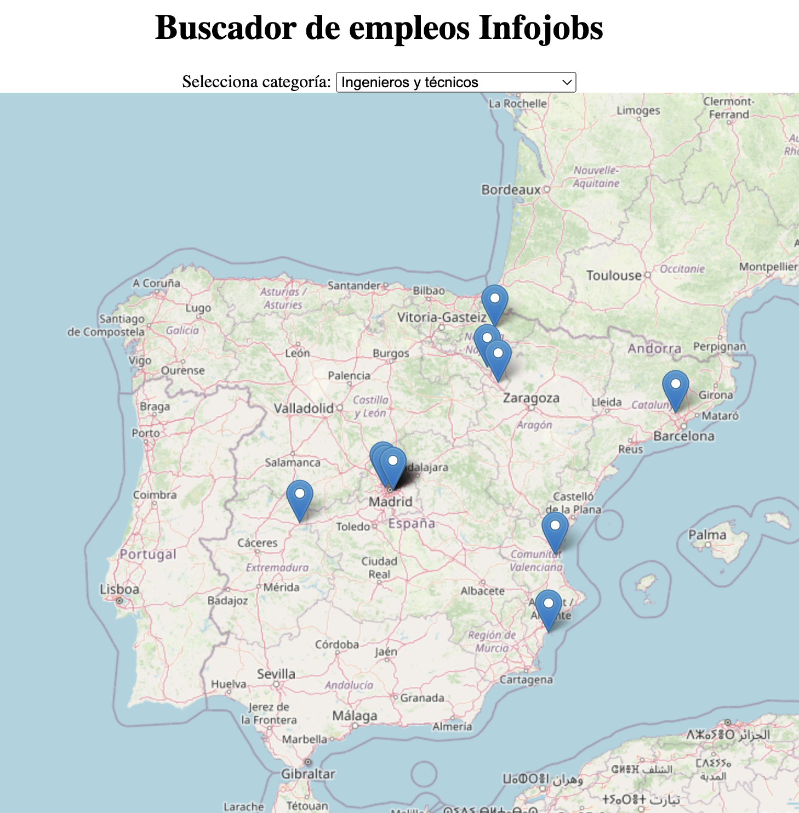

# Jobs Map

**Hackaton Infojobs de Midudev**

Buscador de empleos **Infojobs** mediante un mapa interactivo.





Prueba la aplicación:
https://jobsmap.up.railway.app/map.html


# Tecnologías usadas

- Apis:
    - Infojobs API https://developer.infojobs.net
    - leafletjs https://leafletjs.com/
    - RapidApi Geolocalization https://rapidapi.com/weatherapi/api/weatherapi-com/

- Backend: 
    - NodeJs + express
- Frontend:
    - Vanilla Javascript


# Instalación
```
npm i
npm run dev
```
